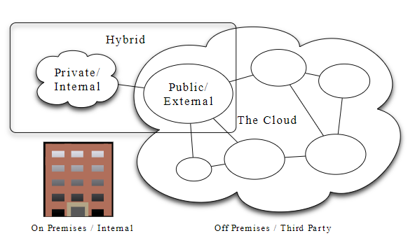

## Cloud
#### Cloud computing is a model that enables remote allocation of computer resources owned by a third party to be utilized by end user

#### Cloud providers offer various services separated in categories:
```
Infrastructure as a Service (IaaS)
Platform as a Service (PaaS)
Software as a Service (SaaS)
Analytics as a Service (AnaaS)
API as a Service (AaaS)
Big Data as a Service (BDaaS)
Business Process as a Service (BPaaS)
Code as a Service (CaaS)
Communications Platform as a Service (CPaaS)
Desktop as a Service (DaaS)
Database as a Service (DBaaS)
Function as a Service (FaaS)
Monitoring as a Service (MaaS)
Anything as a Service (XaaS)
```

#### Key characteristics:
```
Speed
Reduced cost
Easy access to resources
Reliability
Scalability
Security
```

### Types of cloud:
#### Private Cloud:
```
It is designated and operated solely for one organization. It can be hosted internally or externally and managed by internal teams or a third party. A private cloud can be built using a software stack like OpenStack.
```
#### Public Cloud:
```
It is open to the public and anybody can use it, after swiping a credit card, of course. Amazon Web Services, Google Cloud Platform, and Microsoft Azure are examples of public clouds.
```
#### Hybrid Cloud:
```
Storage of sensitive information on the private cloud, while offering public services based on that information from a public cloud.

Meeting temporary resources needs during peak or times of high demand by scaling to the cloud, known as bursting, when such temporary needs of additional computing resources cannot be met by the private cloud.
```

