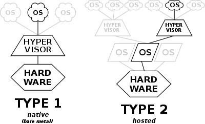

## Virtualization 
#### In order to make possible the cloud deployment models and to implement the characteristics of cloud computing, cloud services providers and self managed cloud deployment tools take advantage of specialized software to implement hardware virtualization. 

### Types of virtualization:
#### Type-1, native or bare-metal hypervisors:
```
Type-1 hypervisor (native or bare-metal) runs directly on top of a physical host machine's hardware, without the need for a host OS. Typically, they are found in enterprise settings. Examples of type-1 hypervisors:

AWS Nitro
IBM z/VM
Microsoft Hyper-V 
Nutanix AHV 
Oracle VM Server for SPARC
Oracle VM Server for x86
Red Hat Virtualization
VMware ESXi
Xen
```
#### Type-2 or hosted hypervisors:
```
Type-2 hypervisor (hosted) runs on top of the host's OS. Typically, they are for end-users, but they may be found in enterprise settings as well. Examples of type-2 hypervisors:

Parallels Desktop for Mac
VirtualBox
VMware Player
VMware Workstation
```
#### Hybrid:
```
They are Linux kernel modules that act as both type-1 and type-2 hypervisors at the same time. Examples are:

KVM
bhyve
```
