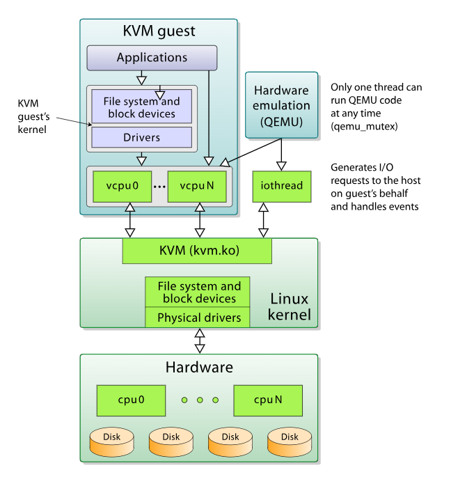

## KVM 
#### KVM is a loadable virtualization module of the Linux kernel and it converts the kernel into a hypervisor capable of managing guest Virtual Machines.

### Features:
```
KVM is an open source software that provides hardware-assisted virtualization to support various guest OSes, such as Linux distributions, Windows, Solaris, etc. 

KVM allows for device abstraction of network interfaces, disk, but not the processor. It exposes the /dev/kvm interface that can be used by an external userspace host for emulation instead. QEMU is an example of such a host. 

KVM supports nested guests, which allow VMs to run within VMs. It also supports hotpluggable devices such as CPUs and PCI devices. Overcommitting is possible as well for the allocation of additional virtualized resources that may not be available on the system. To achieve overcommitting for a VM, KVM dynamically swaps resources from another guest that is not using the type of resource needed.
```
#### Benefits of Using KVM:
```
It is an open source solution, and, as such, free to customize.

Using KVM is efficient from a financial perspective as well, due to the lower costs associated with it.

It provides efficient hardware-assisted virtualization for an array of guest OSes, such as Linux, BSD, Solaris, Windows, Mac OS, ReactOS, and Haiku.
It provides para-virtualization of Ethernet cards, disk I/O controllers, and graphical interfaces for a set of guest OSes, such as Linux, OpenBSD, FreeBSD, and Windows. 

It is highly scalable.

KVM employs advanced security features, utilizing SELinux. It provides MAC (Mandatory Access Control) security between Virtual Machines. KVM has received awards for meeting common government and military security standards and for allowing open virtualization for homeland security projects.
```
